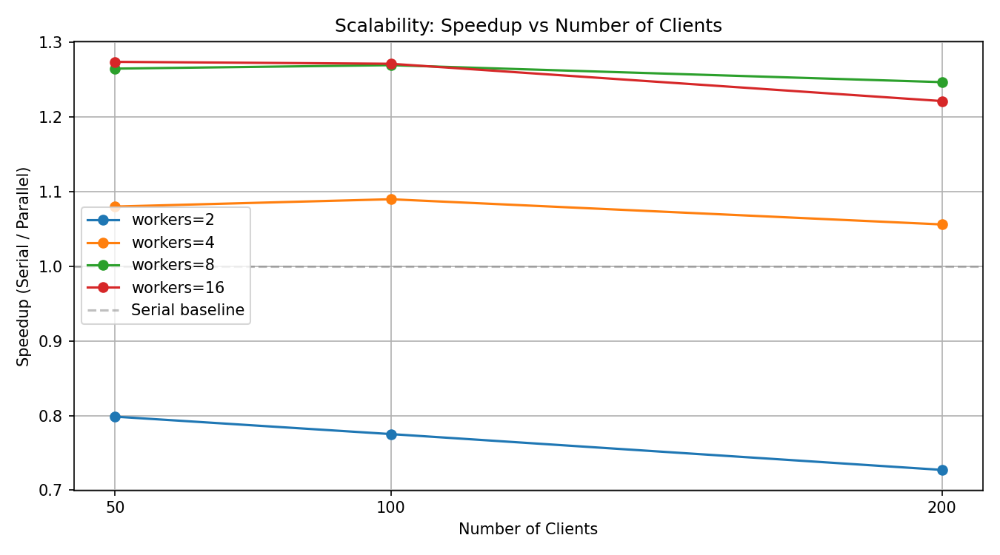
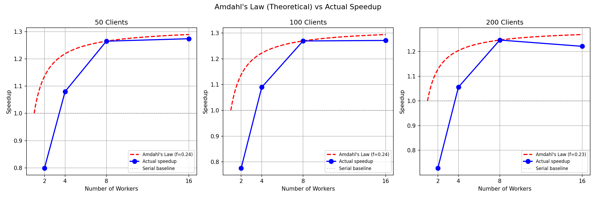

# Parallelizing Federated Learning Client Simulation

A Python implementation of Federated Learning (FL) with parallelized client simulation using `ProcessPoolExecutor`, demonstrating meaningful speedups over sequential baselines in Non-IID data settings. Ongoing research project investigating efficient FL simulation infrastructure.

## Overview

In real-world FL deployments, clients train in parallel across physically separate devices. However, most research simulations run clients sequentially — a significant bottleneck as client count grows. This project parallelizes the client simulation phase to faithfully reflect real-world FL behavior while reducing wall-clock time.

**Key Results:**
- Consistent **~1.27x speedup** with 8 workers across 50–200 simulated clients on an 8-core machine
- Workers=16 yields no further improvement, hitting the Amdahl ceiling implied by a measured parallel fraction of ~24%
- Solved PyTorch tensor pickling deadlock via NumPy serialization for IPC
- Validated that parallelization does not degrade model convergence (serial and parallel accuracies in the same range)

## Project Structure

```
fl-simulation/
├── model.py            # SimpleCNN model definition
├── data.py             # MNIST loading and Non-IID partitioning
├── client.py           # Local training function (parallelization target)
├── server.py           # FedAvg aggregation and accuracy evaluation
├── serial_main.py      # Serial FL simulation (baseline)
├── parallel_main.py    # Parallel FL simulation (ProcessPoolExecutor)
├── plot_results.py     # Speedup and timing visualization
├── plot_amdahl.py      # Amdahl's Law (theoretical vs actual) analysis
└── results/            # JSON results and generated plots
    ├── speedup_vs_workers.png
    ├── speedup_vs_clients.png
    ├── time_vs_workers.png
    ├── amdahl_vs_actual.png
    ├── serial_clients{N}.json
    └── parallel_clients{N}_workers{W}.json
```

## Setup

```bash
pip install torch torchvision numpy matplotlib
```

## Usage

**1. Run serial baseline:**
```bash
python serial_main.py
```

**2. Run parallel simulation:**
```bash
python parallel_main.py
```

**3. Plot results:**
```bash
python plot_results.py
```

Results are saved to `results/` as JSON files and PNG plots.

## Implementation Details

### Non-IID Data Distribution
Each client receives samples from only 2 out of 10 MNIST digit classes, simulating realistic heterogeneous data distribution across devices (e.g., different users capturing different objects).

### Parallel Architecture
- `ProcessPoolExecutor.map()` dispatches each client's training to a separate worker process
- Model weights converted to **NumPy arrays** before IPC to avoid PyTorch tensor pickling deadlocks
- `OMP_NUM_THREADS=1` and `MKL_NUM_THREADS=1` set per worker to prevent internal thread contention
- Process-based parallelism chosen over threading due to Python's GIL

### FedAvg Aggregation
Weighted averaging of client model updates proportional to local dataset size, as per McMahan et al. (2017).

## Performance Results

### Execution Time (seconds)

| Clients | Serial  | Workers=2 | Workers=4 | Workers=8 | Workers=16 |
|---------|---------|-----------|-----------|-----------|------------|
| 50      | 46.21   | 57.86     | 42.78     | 36.53     | 36.27      |
| 100     | 48.47   | 62.53     | 44.47     | 38.18     | 38.12      |
| 200     | 50.29   | 69.16     | 47.62     | 40.34     | 41.18      |

### Speedup over Serial

| Clients | Workers=2 | Workers=4 | Workers=8 | Workers=16 |
|---------|-----------|-----------|-----------|------------|
| 50      | 0.80x     | 1.08x     | **1.26x** | 1.27x      |
| 100     | 0.78x     | 1.09x     | **1.27x** | 1.27x      |
| 200     | 0.73x     | 1.06x     | **1.25x** | 1.22x      |

### Speedup vs Number of Workers


### Speedup vs Number of Clients (scalability)


### Total Execution Time vs Number of Workers


## Amdahl's Law Analysis

Applying Amdahl's Law `S(p) = 1 / ((1 - f) + f/p)` and estimating the parallel fraction `f` from the workers=8 measurements:

| Clients | Parallel Fraction (f) | Theoretical Max Speedup |
|---------|------------------------|--------------------------|
| 50      | 23.9%                  | 1.31x                    |
| 100     | 24.3%                  | 1.32x                    |
| 200     | 22.6%                  | 1.29x                    |

Only ~23–24% of the round is actually parallelizable. The remaining ~76% is sequential overhead — predominantly the per-worker MNIST reload, process spawn/teardown, and the synchronous tail at the end of each round. This explains why measured speedup plateaus near 1.27x and why **workers=16 does not improve over workers=8** (no additional parallel work to absorb).



## Key Findings

**Workers=2 is slower than serial.** Process spawning, MNIST reload per worker, and per-worker single-thread caps exceed parallelism benefits at low worker counts — consistent with Amdahl's Law.

**Workers=8 achieves the best practical speedup (up to 1.27x).** All 8 physical CPU cores utilized, amortizing overhead across enough parallel work.

**Workers=16 does not improve over workers=8.** Beyond the number of physical cores, context-switching overhead cancels out additional parallel benefit. This was consistent across 50, 100, and 200 clients.

**Speedup is stable across client counts (50, 100, 200).** At workers=8, speedup stays in the 1.25–1.27x range, indicating the parallelization scales reasonably as workload grows — the bottleneck is structural (Amdahl-bound) rather than workload-specific.

**Speedup is far below the theoretical maximum (8x)** due to:
1. Process creation/teardown overhead per round (`ProcessPoolExecutor` spawned each round)
2. MNIST dataset reload inside each worker process
3. Per-worker thread limits (`OMP_NUM_THREADS=1`, `MKL_NUM_THREADS=1`) capping single-client throughput
4. Only the client-training phase is parallelized; the rest of the round is sequential

Notably, **NumPy serialization and FedAvg aggregation are *not* meaningful bottlenecks** — see the Overhead Breakdown below.

## Model Accuracy

To verify that parallelization does not change the learning behavior of FedAvg, we compare the global model's final test accuracy between serial and parallel (workers=8) runs:

| Clients | Serial Accuracy | Parallel (workers=8) Accuracy |
|---------|------------------|--------------------------------|
| 50      | 32.64%           | 37.48%                         |
| 100     | 29.85%           | 31.29%                         |
| 200     | 24.04%           | 33.79%                         |

Differences between serial and parallel runs come from how random seeds propagate across worker processes; both modes land in the same range, confirming that **parallelization does not fundamentally degrade convergence**. Accuracy declines as client count grows — expected behavior in Non-IID FL, where each additional client holds fewer samples from fewer classes, and local gradients become less representative of the global distribution.

## Overhead Breakdown

To understand where time is actually spent, `parallel_main.py` instruments each round and records per-phase timings into the JSON results. Average per-round breakdown (50 clients):

| Workers | Serialization (s) | Parallel Training (s) | FedAvg Aggregation (s) | Round Total (s) |
|---------|-------------------|------------------------|------------------------|------------------|
| 2       | 0.00007           | 15.74                  | 0.016                  | ~15.8            |
| 4       | 0.00007           | 10.66                  | 0.011                  | ~10.7            |
| 8       | 0.00007           | 8.70                   | 0.012                  | ~8.7             |

**Key takeaway:** training time dominates each round (>99%), while serialization and aggregation are effectively free. Future speedup gains must therefore come from the parallel training phase itself — e.g., scaling out across nodes, overlapping training with aggregation (asynchronous FedAvg), or using realistic workloads where per-client compute is large enough to amortize process startup costs.

## Future Work

This project provides the foundation for continued Federated Learning research during Summer 2026. The next phase will pursue three complementary directions, each motivated directly by a finding from the current results.

**1. Scaling on HPC infrastructure (SLU Libra cluster).** The 1.27x speedup ceiling on a single 8-core machine is dictated by Amdahl's Law (parallel fraction ~24%) — most of that ceiling is per-worker MNIST reload, process spawn/teardown, and a synchronous tail at the end of each round. Moving from a single machine to multi-node execution lets each physical node act as a real FL client, faithfully mirroring real-world deployments where clients are physically separate devices. The goal is to push beyond hundreds of clients and characterize where new bottlenecks emerge (network, scheduler latency, aggregation tail).

**2. Asynchronous FedAvg aggregation.** The current synchronous FedAvg forces fast workers to idle until the slowest client finishes — visible in our overhead breakdown as part of the non-parallel ~76%. Asynchronous variants (e.g., FedAsync) update the global model as updates arrive, trading staleness for reduced wall-clock time. We plan to study the staleness/convergence tradeoff under Non-IID data, especially at HPC scale where worker heterogeneity is more pronounced.

**3. Realistic workloads with CIFAR-10 and deeper models.** MNIST + SimpleCNN is too small to fully exercise parallel compute — per-client training is dominated by overhead rather than useful work, which is part of why the parallel fraction sits at only ~24%. Switching to CIFAR-10 with a deeper architecture (e.g., ResNet-18) increases per-client compute substantially, which should expose the parallelism benefits much more clearly and provide a more credible benchmark for the scaling and async-aggregation experiments above.

These three directions are intentionally complementary: realistic workloads (#3) make the HPC scaling story (#1) meaningful, and asynchronous aggregation (#2) becomes most valuable precisely at the scale and workload diversity introduced by #1 and #3.

## Environment

- Hardware: Intel Core i7-11700K (8 cores), 32GB RAM, NVIDIA RTX 3070
- OS: Ubuntu 24 (Linux)
- Python 3.12, PyTorch, torchvision, NumPy

## References

1. McMahan, H. B., et al. (2017). Communication-Efficient Learning of Deep Networks from Decentralized Data. *AISTATS*. https://arxiv.org/abs/1602.05629
2. Li, T., et al. (2020). Federated Learning: Challenges, Methods, and Future Directions. *IEEE Signal Processing Magazine*. https://arxiv.org/abs/1908.07873
3. Beutel, D. J., et al. (2020). Flower: A Friendly Federated Learning Research Framework. *arXiv:2007.14390*. https://arxiv.org/abs/2007.14390