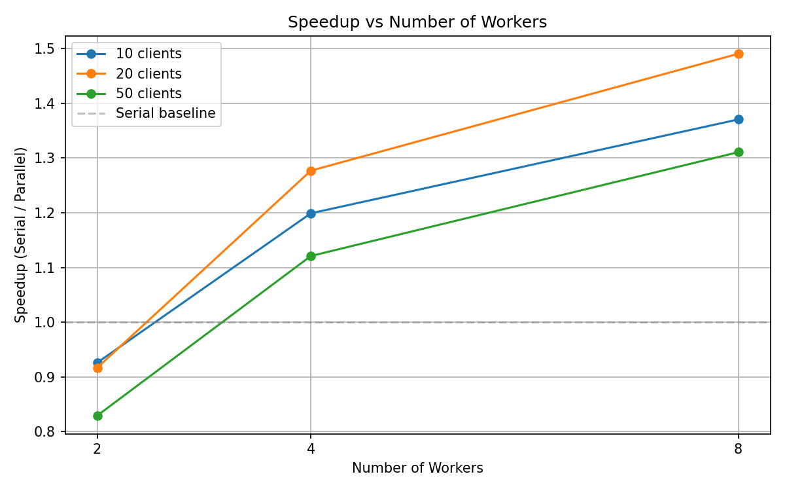
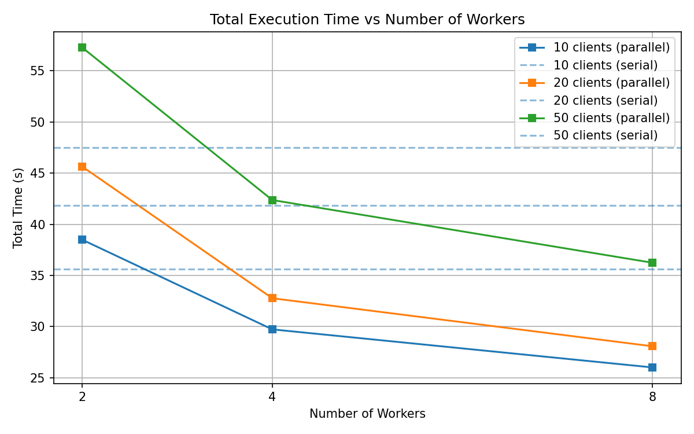

# Parallelizing Federated Learning Client Simulation

A Python implementation of Federated Learning (FL) with parallelized client simulation using `ProcessPoolExecutor`, demonstrating meaningful speedups over sequential baselines in Non-IID data settings.

## Overview

In real-world FL deployments, clients train in parallel across physically separate devices. However, most research simulations run clients sequentially — a significant bottleneck as client count grows. This project parallelizes the client simulation phase to faithfully reflect real-world FL behavior while reducing wall-clock time.

**Key Results:**
- Up to **1.49x speedup** with 8 workers and 20 clients on an 8-core machine
- Solved PyTorch tensor pickling deadlock via NumPy serialization for IPC
- Validated that parallelization does not degrade model convergence

## Project Structure

```
fl-simulation/
├── model.py            # SimpleCNN model definition
├── data.py             # MNIST loading and Non-IID partitioning
├── client.py           # Local training function (parallelization target)
├── server.py           # FedAvg aggregation and accuracy evaluation
├── serial_main.py      # Serial FL simulation (baseline)
├── parallel_main.py    # Parallel FL simulation (ProcessPoolExecutor)
├── plot_results.py     # Speedup and timing visualization
└── results/            # JSON results and generated plots
    ├── speedup_vs_workers.png
    ├── time_vs_workers.png
    ├── serial_clients{N}.json
    └── parallel_clients{N}_workers{W}.json
```

## Setup

```bash
pip install torch torchvision numpy matplotlib
```

## Usage

**1. Run serial baseline:**
```bash
python serial_main.py
```

**2. Run parallel simulation:**
```bash
python parallel_main.py
```

**3. Plot results:**
```bash
python plot_results.py
```

Results are saved to `results/` as JSON files and PNG plots.

## Implementation Details

### Non-IID Data Distribution
Each client receives samples from only 2 out of 10 MNIST digit classes, simulating realistic heterogeneous data distribution across devices (e.g., different users capturing different objects).

### Parallel Architecture
- `ProcessPoolExecutor.map()` dispatches each client's training to a separate worker process
- Model weights converted to **NumPy arrays** before IPC to avoid PyTorch tensor pickling deadlocks
- `OMP_NUM_THREADS=1` and `MKL_NUM_THREADS=1` set per worker to prevent internal thread contention
- Process-based parallelism chosen over threading due to Python's GIL

### FedAvg Aggregation
Weighted averaging of client model updates proportional to local dataset size, as per McMahan et al. (2017).

## Performance Results

### Execution Time (seconds)

| Clients | Serial  | Workers=2 | Workers=4 | Workers=8 |
|---------|---------|-----------|-----------|-----------|
| 10      | 35.64   | 38.49     | 29.72     | 26.00     |
| 20      | 41.84   | 45.64     | 32.77     | 28.07     |
| 50      | 47.49   | 57.28     | 42.37     | 36.24     |

### Speedup over Serial

| Clients | Workers=2 | Workers=4 | Workers=8 |
|---------|-----------|-----------|-----------|
| 10      | 0.93x     | 1.20x     | 1.37x     |
| 20      | 0.92x     | 1.28x     | **1.49x** |
| 50      | 0.83x     | 1.12x     | 1.31x     |

### Speedup vs Number of Workers


### Total Execution Time vs Number of Workers



## Key Findings

**Workers=2 is slower than serial.** Process spawning, NumPy serialization, and IPC overhead exceed parallelism benefits at low worker counts — consistent with Amdahl's Law.

**Workers=8 achieves the best speedup (up to 1.49x).** All 8 physical CPU cores utilized, amortizing overhead across enough parallel work.

**20 clients achieves the best speedup.** With 10 clients, workload per worker is too small. With 50 clients, each worker handles ~6 clients sequentially, reducing relative benefit.

**Speedup is below theoretical maximum (8x)** due to:
1. Process creation/teardown overhead per round
2. NumPy serialization/deserialization of model weights
3. MNIST dataset reload inside each worker
4. Sequential FedAvg aggregation step

## Future Work

- Scale to larger client counts (100, 200) on HPC cluster (SLU Libra)
- GPU-accelerated per-client training using CUDA
- Asynchronous FedAvg aggregation to reduce idle time
- Test with CIFAR-10 and more complex model architectures
- Explore FedProx for improved convergence under Non-IID settings

## Environment

- Hardware: Intel Core i7-11700K (8 cores), 32GB RAM, NVIDIA RTX 3070
- OS: Ubuntu 24 (Linux)
- Python 3.12, PyTorch, torchvision, NumPy

## References

1. McMahan, H. B., et al. (2017). Communication-Efficient Learning of Deep Networks from Decentralized Data. *AISTATS*.
2. Li, T., et al. (2020). Federated Learning: Challenges, Methods, and Future Directions. *IEEE Signal Processing Magazine*.
3. Beutel, D. J., et al. (2020). Flower: A Friendly Federated Learning Research Framework. *arXiv:2007.14390*.